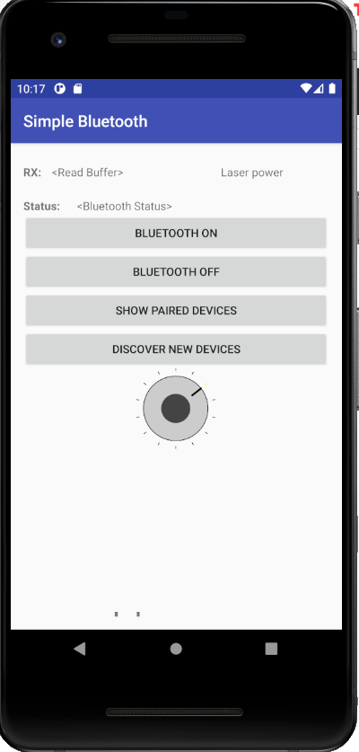

# LED-Blutooth-Control
- This is an Android app that uses a spin dial to select intensity power for a LED via Bluetooth. The HC-05 Bluetooth module is used for hardware with an Arduino Uno.

- Credit to [Justin Bauer](http://mcuhq.com/27/simple-android-bluetooth-application-with-arduino-example) of mcuhq for the SimpleBluetooth app skeleton to toggle LED using Bluetooth. 
